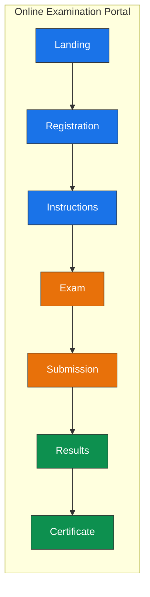
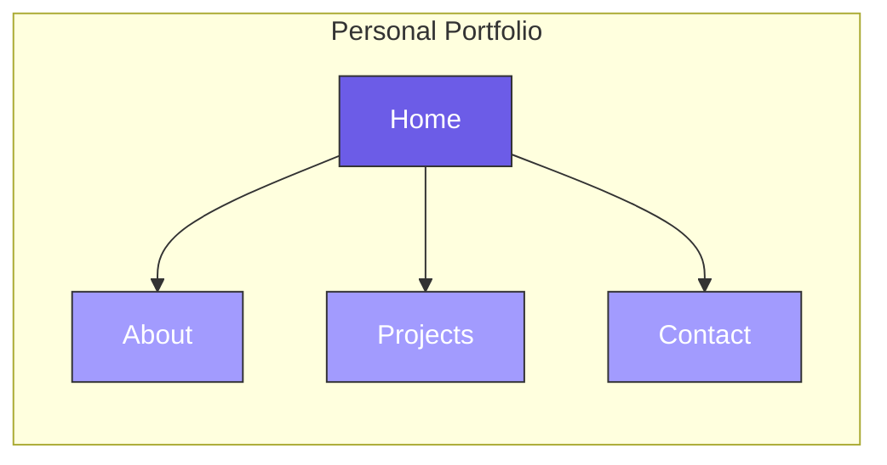
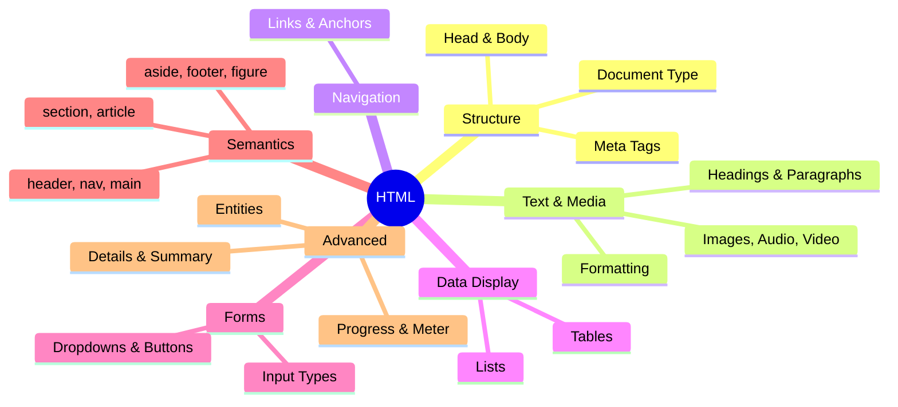

<div align="center">

# 🚀 HTML Learning Journey

**A hands-on, beginner-friendly path to mastering HTML — from basics to real projects.**

[](https://developer.mozilla.org/en-US/docs/Web/HTML)
[]()
[](LICENSE)

</div>

---

## 🗺️ Learning Roadmap

```mermaid
graph LR
    A["1. Basics"] --> B["2. Links & Media"]
    B --> C["3. Lists"]
    C --> D["4. Tables"]
    D --> E["5. Forms"]
    E --> F["6. Semantics"]
    F --> G["7. Advanced"]
    G --> H["Mini Projects"]
    H --> I["Final Projects"]

    style A fill:#FF6B6B,stroke:#333,color:#fff
    style B fill:#FFA07A,stroke:#333,color:#fff
    style C fill:#FFD700,stroke:#333,color:#333
    style D fill:#98FB98,stroke:#333,color:#333
    style E fill:#87CEEB,stroke:#333,color:#333
    style F fill:#9370DB,stroke:#333,color:#fff
    style G fill:#FF69B4,stroke:#333,color:#fff
    style H fill:#20B2AA,stroke:#333,color:#fff
    style I fill:#4169E1,stroke:#333,color:#fff
```



---

## 📂 Project Structure

```
HTML-LEARNING-JOURNEY/
│
├── html1_basics.html             # Headings, paragraphs, text formatting
├── html2_link&img.html           # Links, images, audio, video
├── html3_lists.html              # Ordered, unordered, nested, description lists
├── html4_table.html              # Tables, colspan, rowspan
├── html5_forms.html              # Inputs, radio, checkbox, dropdowns, file upload
├── html6_semantics.html          # header, nav, main, section, article, footer
├── html7_advanced_html.html      # Entities, details/summary, progress, meter, code
│
├── mini projects/
│   ├── 1calculator.html          # Calculator UI
│   ├── 2to-do-list.html          # To-Do List with checkboxes
│   ├── 3photo_album.html         # Photo gallery
│   └── 4retaurant_menu.html      # Restaurant menu with combos
│
└── final project/
    ├── ONLINE EXAMINATION PORTAL/  # 7-page exam system
    └── PORTFOLIO/                  # 4-page personal portfolio
```

---

## 🎯 Final Projects





---

## 🧠 Topics Covered



---

## 🚀 Getting Started

```bash
git clone https://github.com/Nirmiteevats/HTML-LEARNING-JOURNEY.git
cd HTML-LEARNING-JOURNEY
# Open html1_basics.html in your browser and follow the numbered sequence!
```

---

## 🤝 Contributing

Fork → Branch → Commit → Push → Pull Request. All contributions welcome!

---

<div align="center">

**Made with ❤️ by [Nirmitee Vats](https://github.com/Nirmiteevats)**

⭐ Star this repo if it helped you!

</div>
